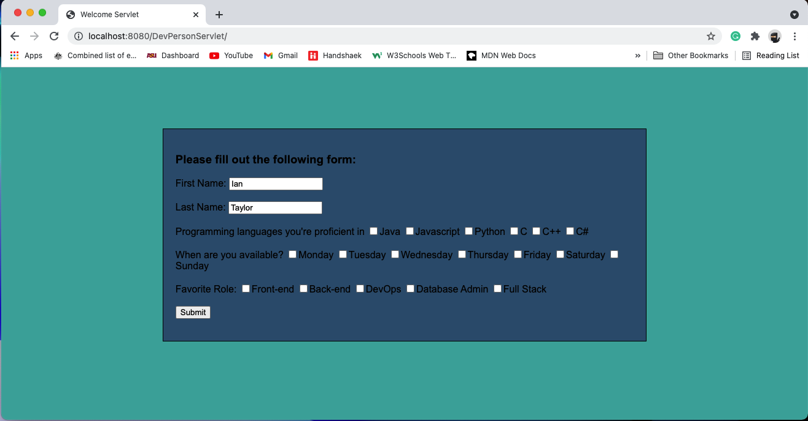
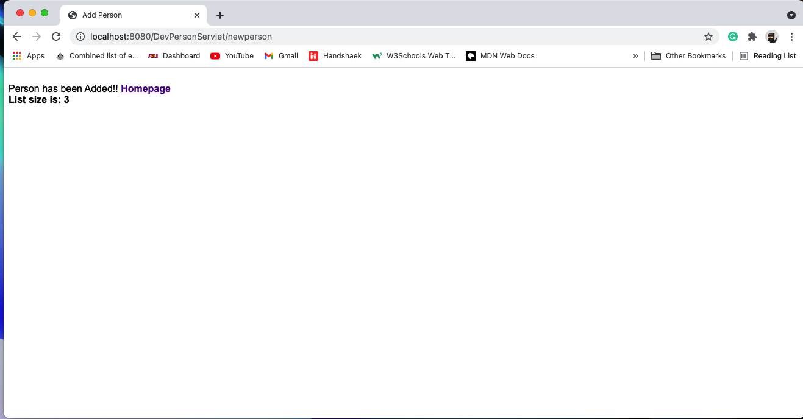

# JavaWebAppDev
Java web application development

# AppServletAddDevPersonnel

A basic web application using servlets that offers a form for you to add a person to with certain dev attributes. This  information is then stored in a list.

Input form:

Successfully added:

getpersons screenshot:

